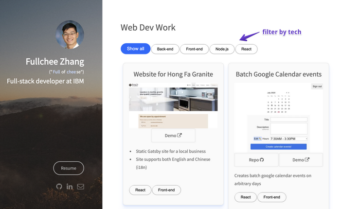

# portfolio

Made with

- Next.js
- Tailwind
- TypeScript

Inspired by

- Josh Comeau's [Building an Effective Dev Portfolio](https://www.joshwcomeau.com/effective-portfolio/)
- juliacodes.com

## Install

1. `npm i`
2. `npm run dev`

## Deploy

`git push origin main`

## Trello

https://trello.com/b/4QT3eZgJ/portfolio

## Previous Portfolios

### [2020 Portfolio](https://github.com/Fullchee/2020-portfolio)

- Gatsby
- filter by tech
- 

### [2019 Portfolio](https://github.com/Fullchee/2019-portfolio)

- Vanilla HTML, CSS
- [Based on this template](https://ryanfitzgerald.github.io/devportfolio/)

## Dependencies

- next
  - [the react docs](https://react.dev/learn/start-a-new-react-project) recommend a framework and Next can do all the things (but I just need a static site)

### Dev dependencies

- sharp
  - convert large images to smaller web friendly images of varying dimensions
  - I guess this means we don't need Cloudinary?
  - [Used for production builds](https://nextjs.org/docs/messages/sharp-missing-in-production)
