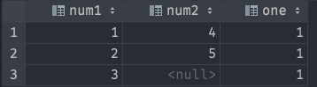
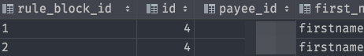

[[psql]]

### What UNNEST does

```sql
SELECT 
UNNEST(ARRAY\[1,2,3\]) as num1
UNNEST(ARRAY\[4,5\]) as num2
1 as one
```




### Example of using UNNEST

```sql
SELECT
    UNNEST(ARRAY[column_1, column_2]) AS rule_block_id,
    *
FROM table_name
```

