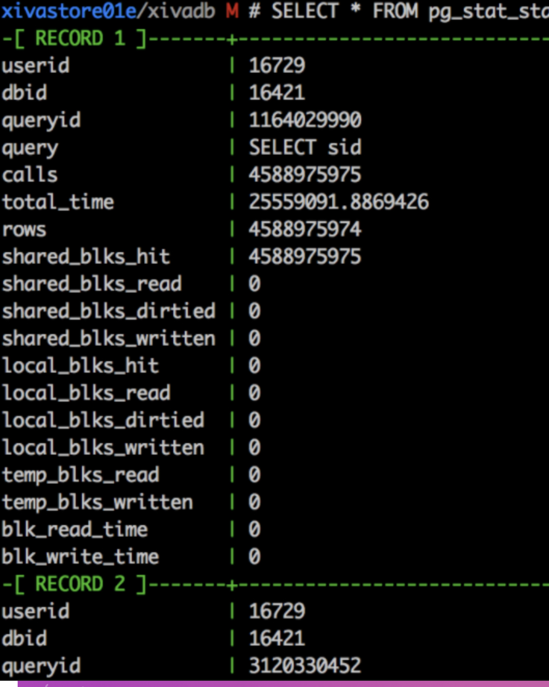

[[psql]]
If you have to use the psql shell and you  
`SELECT * FROM giant_table`it might look like

If you type`\x auto`

before typing your select statement, it’ll look like screenshot 2 where you can see 1 row at a time

On Windows, you can create a`psqlrc.conf`in`%APPDATA%/postgres`

https://stackoverflow.com/questions/9604723/alternate-output-format-for-psql/16108898#16108898

#### `psqlrc`
In the files below, add this line
`\x auto`

* Mac
    * `~/.psqlrc`
* Windows
    * `%APPDATA\postgres`
    * https://stackoverflow.com/questions/64734341/where-is-the-psqlrc-file-on-windows